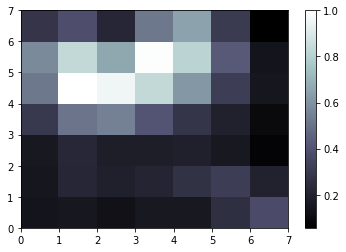
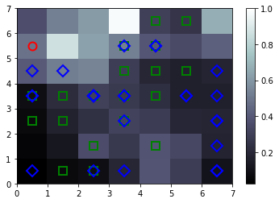

# Self-Organising-Map-on-Iris-Dataset

## Code Requirements
You can use Spider or any IDE of your choice.

## Description
A self-organizing map (SOM) is a type of artificial neural network (ANN)  that is trained using unsupervised learning to produce a low-dimensional (typically two-dimensional), discretized representation of the input space of the training samples, called a map, and is therefore a method to do dimensionality reduction. Here I have implemented this on  Iris dataset.

Reference read material :

https://en.wikipedia.org/wiki/Self-organizing_map

https://www.sciencedirect.com/topics/engineering/self-organizing-map

## Implementation

In simpler terms, the darker parts represent clusters, while the lighter parts represent the division of the clusters.

## Result SOM

 Red,iris-setosa, Green,iris-versicolor ,Blue,iris-virginica

